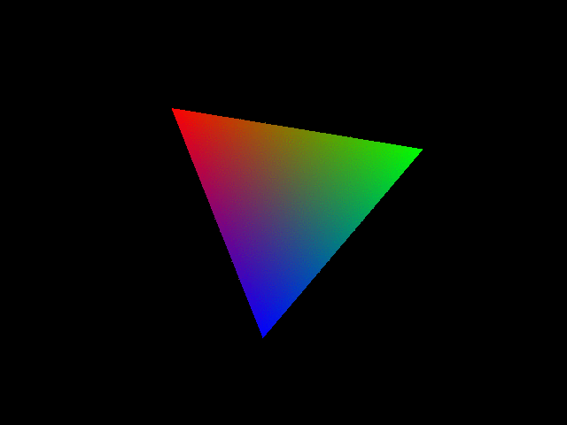

## Tutorial 1:

Create `HelloWorld!` for fixed pipeline OpenGL.

#### Contents:
1. Initialize GLFW3.
`glfwInit`
2. Create GLFW3 Window.
`glfwCreateWindow`
3. Set Window to OpenGL Context.
`glfwMakeContextCurrent`
4. Game loop.
  i. Check for GLFW closed.
  ii. Set Framebuffer size.
  iii. Set Viewport.
  iv. Clear Framebuffer.
  v. Set Projection Matrix.
  vi. Set ModelView Matrix.
  vii. Draw the triangle.
  viii. Swap buffer.
  ix. Process events.

